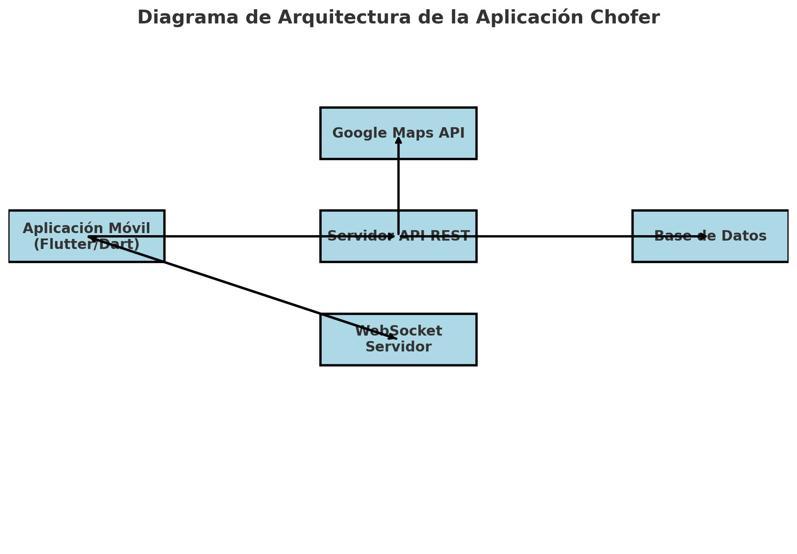

# Documentación del Proyecto: Aplicación Chofer

## 1. Introducción

### Descripción General
La "Aplicación Chofer" es una aplicación móvil diseñada para facilitar a los choferes la gestión de sus viajes. Los choferes pueden registrarse, iniciar sesión, crear y gestionar viajes, y actualizar la información en tiempo real durante un viaje.

### Objetivo
El objetivo de la aplicación es permitir que los choferes gestionen eficientemente sus viajes, desde la creación de rutas hasta la recogida de pasajeros, utilizando funcionalidades de mapas y actualizaciones en tiempo real.

### Tecnologías Utilizadas
- **Flutter**: Para la creación de la interfaz de usuario.
- **Dart**: Lenguaje de programación utilizado en Flutter.
- **Google Maps API**: Para la selección de rutas y puntos de recogida.
- **API REST**: Para la comunicación entre la aplicación y el servidor.
- **WebSockets**: Para la actualización en tiempo real de la ubicación y estado del viaje.

## 2. Requisitos

### Requisitos Funcionales
1. **Registro e Inicio de Sesión**: Los choferes deben poder registrarse e iniciar sesión utilizando email y contraseña.
2. **Gestión de Viajes**: Los choferes pueden ver una lista de sus viajes pendientes, crear nuevos viajes, y gestionar viajes en curso.
3. **Selección de Rutas**: Integración con Google Maps para seleccionar el origen y destino de los viajes.
4. **Actualización en Tiempo Real**: El trayecto del viaje se actualiza en tiempo real mediante Sockets.io.

### Requisitos No Funcionales
1. **Seguridad**: Todas las peticiones autenticadas requieren un token de autorización.
2. **Persistencia de Sesión**: La sesión del chofer debe mantenerse activa entre usos de la aplicación.
3. **Rendimiento**: La aplicación debe responder rápidamente, especialmente durante la actualización de rutas en tiempo real.

## 3. Arquitectura del Sistema

### Diagrama de Arquitectura
*(Aquí se incluiría un diagrama que muestre la interacción entre la aplicación, el servidor, las APIs, y Sockets.io)*

### Descripción de Componentes
- **Pantalla de Inicio**: Módulo para la autenticación de usuarios.
- **Pantalla Principal**: Muestra la lista de viajes y la opción para crear nuevos.
- **Mapa**: Componente para la selección de rutas y puntos de recogida.
- **Sockets.io Handler**: Gestiona la conexión al socket y la actualización de datos en tiempo real.

## 4. Pantallas de la Aplicación

### Pantalla de Inicio (Login/Registro)
- **Inicio de Sesión**: Solicita email y contraseña, hace un POST a `/api/logindriver`.
- **Registro**: Permite al chofer registrar su cuenta y los datos de su vehículo. POST a `/api/registerdriver`.

### Pantalla Principal (Lista de Viajes)
- **Lista de Viajes**: Se muestra una lista de viajes obtenidos mediante un GET a `/api/trips`.
- **Creación de Viaje**: Botón que lleva a la pantalla de creación de viaje.

### Pantalla de Creación de Viaje
- **Selección de Rutas**: Permite seleccionar origen y destino en el mapa.
- **Generación de Ruta**: Muestra la ruta calculada por Google Maps.
- **Datos del Viaje**: Campos para asientos disponibles, precio, fecha y hora.
- **Puntos de Recogida**: Selección de puntos de recogida en el mapa.

### Pantalla de Viaje Activo
- **Mapa del Viaje**: Muestra la ruta y puntos de recogida.
- **Actualización en Tiempo Real**: Conexión al socket para actualizar el trayecto cada 30 segundos.

## 5. Integraciones

### Autenticación y Autorización
- **Token de Autorización**: Todas las peticiones autenticadas requieren el encabezado `Authorization` con el token.

### API REST
- **/api/logindriver**: POST para iniciar sesión.
- **/api/registerdriver**: POST para registrar un nuevo chofer.
- **/api/trips**: GET para obtener la lista de viajes, POST para crear un nuevo viaje.
- **/api/trips/{id}/start**: POST para iniciar un viaje.

### Google Maps API
- **Selección de Rutas**: Implementación para mostrar y seleccionar rutas en el mapa.
- **Generación de Ruta**: Uso de la API para generar rutas entre origen y destino.

### Socket.io
- **Conexión**: Conexión al WebSocket del viaje para actualizaciones en tiempo real.
- **Eventos**:
  - `identificarChofer`: Para conectar al socket.
  - `actualizarChofer`: Envía la ubicación actual cada 30 segundos.
  - `enPuntoRecogida`: Marca cuando el chofer llega a un punto de recogida.
  - `dejandoPuntoRecogida`: Marca cuando el chofer deja un punto de recogida.
  - `finalizarViaje`: Marca el viaje como finalizado.

## 6. Implementación

### Estructura del Proyecto
- **lib/**: Carpeta principal que contiene todos los archivos de Dart.
  - **main.dart**: Punto de entrada de la aplicación.
  - **pages/**: Contiene las pantallas de la aplicación.
  - **models/**: Modelos de datos.
  - **storage/**: Almacen en cache de Token de inicio de sesión.

### Configuración de Dependencias
- **google_maps_flutter**: Para la integración con Google Maps.
- **socket_io_client**: Para manejar Sockets.io.

### Persistencia de Sesión
- **Shared Preferences**: Utilizado para guardar y recuperar el token de sesión.

## 7. Pruebas

### Pruebas Unitarias
- **Pruebas de Modelo**: Validación de modelos de datos.

### Pruebas de Integración
- **API REST**: Pruebas para asegurarse de que las peticiones a la API funcionan correctamente.

### Pruebas de UI
- **Pantallas**: Pruebas de flujo en las pantallas clave de la aplicación.

## 8. Despliegue

### Configuración de Entorno
- **Desarrollo**: Configurar variables de entorno para API keys y URLs.
- **Producción**: Instrucciones para generar builds de la aplicación para Android.

### Despliegue en Dispositivos
- **Android**: Uso de Android Studio para compilar y desplegar la aplicación.

## 9. Conclusión

### Resumen Final
La "Aplicación Chofer" proporciona una solución integral para la gestión de viajes, utilizando tecnologías modernas y prácticas de desarrollo eficientes.

### Futuras Mejoras
- **Notificaciones Push**: Para alertar a los choferes de nuevos pasajeros.
- **Historial de Viajes**: Implementar un módulo para revisar viajes pasados.

## 10. Anexos

### Referencias
- **Documentación de Flutter**: https://flutter.dev/docs
- **Google Maps API**: https://developers.google.com/maps/documentation
